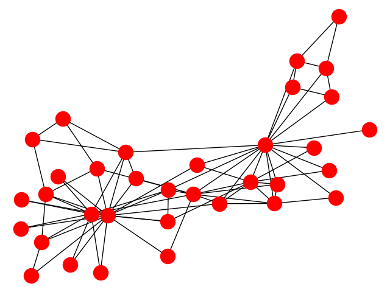
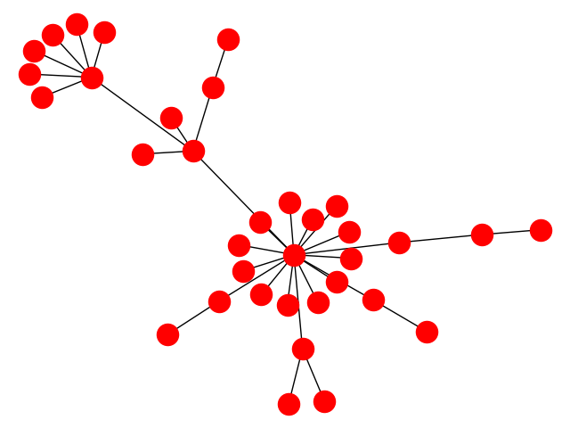
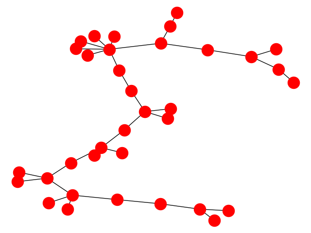
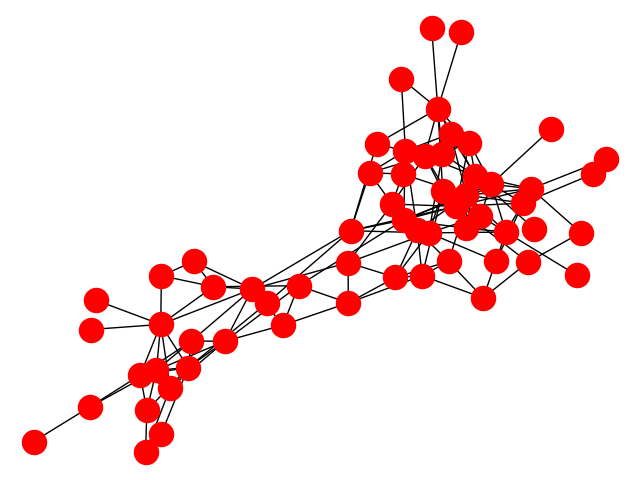
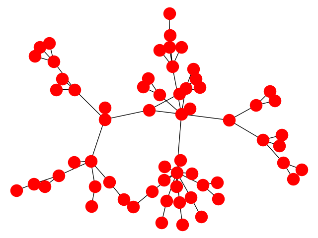
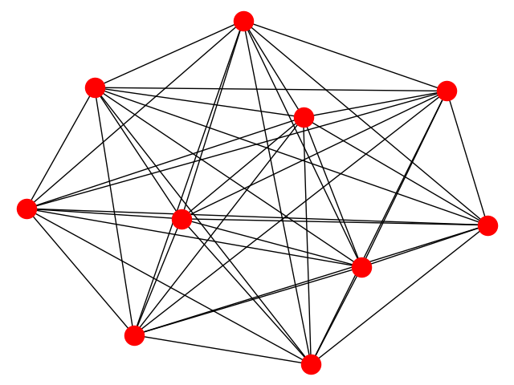
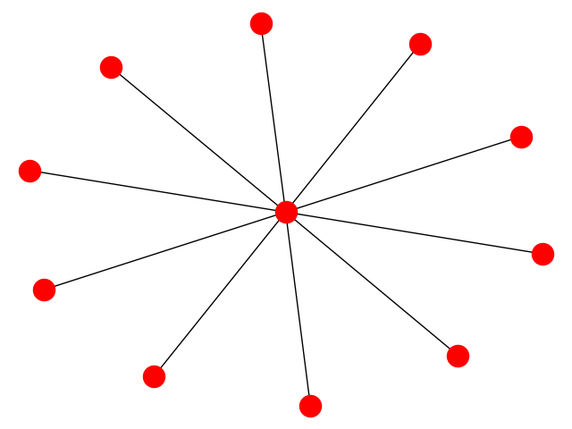
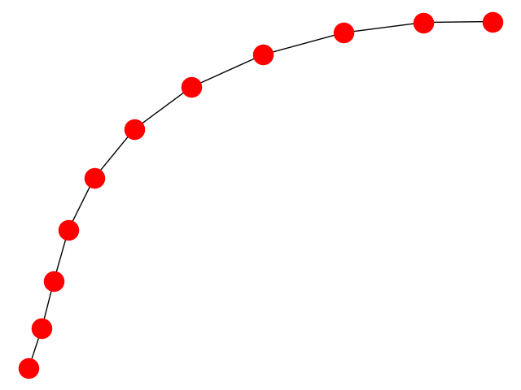

#BFS AND DFS

Implementar os algoritmos BFS e DFS para extrair as árvores BFS-tree e DFS-tree dos grafos a seguir.
LINK: Zachary's karate club (utilizar o arquivo karate.paj)
LINK: Dolphins social network (utilizar o arquivo dolphins.paj)
OBS: Para ler um grafo no formato .paj 

	import networkx as nx
	G = nx.read_pajek('karate.paj')

Para implementar a solução desse problema foi utilizado o pseudo código existente nas páginas 38 e 39 das notas de aula disponibilizadas pelo professor:

##PSEUDOCÓDIGO

	BFS(G, s)
	{
		for each v∈V−{s}
		{
			v.color = WHITEλ(v)=∞π(v)=nil
		}
		s.color = GRAY
		λ(s)=0
		π(v)=nil
		Q=∅
		push(Q, s)
		while Q≠∅
		{
			u = pop(Q)
			for each v∈N(u) // para todo vizinho de u
			{
				if v.color == WHITE // se ainda não passei por aqui, processo vértice v
				{
					λ(v)=λ(u)+1 // v é descendente de u então distancia +1
					π(v)=u
					v.color = GRAY
					push(Q, v) // adiciona v no final da fila
				}
			}
			u. color = BLACK // Após explorar todos vizinhos de u, finalizo u
		}
	}

O pseudo código foi facilmente convertido para python3 através das bibliotecas:
	
	- networkx: para tratar os grafos, vértices, arestas e atributos destes, como a cor de cada vértice
	- queue: para tratar a fila FIFO
	- matplotlib.pyplot: para gerar as imagens no final da execução do programa

Porém, o pseudo código não retorna uma árvore em si, somente adiciona atributos aos vértices, são eles:
	
	-cor
	-delta: distância da raiz
	-pi: nó antecessor

O único atributo que precisamos fazer uso após o algoritmo ter sido executado é 'pi', assim, criamos um grafo T com os mesmo vértices de G e adicionamos somente as arestas correspondentes à um nó e seu atributo 'pi'.

	#gerando Tree
	BFS_Tree = nx.Graph()
	for node in G.node:
		BFS_Tree.add_node(node)
	for node in G.node:
		BFS_Tree.add_edge(node, G.nodes[node]['pi'])

Com a árvore gerada podemos imprimir os grafos através das funções nx.draw() e plt.show()

	import networkx as nx
	import queue as q
	import matplotlib.pyplot as plt
	nx.draw(G)
	plt.show()
	nx.draw(Tree)
	plt.show()

Primeiramente aparecerá uma tela com a imagem do grafo inicial G, e quando a fecharmos outra tela será mostrada, dessa vez cam a BFS Tree do grafo anterior.
O comando para executar o programa é

	$ python3 BFS.py 'arquivo' 'node'

Onde arquivo é o nome (incluindo extenção) do arquivo '.paj' que contém o grafo e node é o nó raiz do algoritmo. Se o arquivo não for passado como parãmetro o programa executa por padrão com um grafo completo de tamanho 10. E se o nó raiz não for passado o primeiro nó do grafo é usado como raiz.

O mesmo procedimento foi realizado para o algoritmo DFS, não sendo necessária apenas a biblioteca queue, pois esse algoritmo trabalha com pilhas ao invés de filas, usando recursividade como abstração da pilha. O pseudocódigo contido na oágina 43 das notas de aula foi utilizado como base para implementação:

##PSEUDOCÓDIGO

	DFS(G, s)
	{
		for each u∈V
		{
			u.color = WHITE
			π(u)=nil
		}
		time = 0 // variável global para armazenar o tempo
		DFS_visit(G, s)
	}

	// Função recursiva que é chamada sempre que um vértice é descoberto
	DFS_visit(G, u)
	{
		time++
		u.d = time
		u.color = GRAY
		for each v∈N(u)
		{
			if v.color == WHITE
			{
				π(v)=u
				DFS_visit(G, v) // chamada recursiva
			}
		}
		u.color = BLACK
		time++
		u.f = time
	}

O atributo time foi ignorado, apesar de aparecer no pseudo código ele não é essencial para gerar a árvore, útil apenas para análise.

A mesma ordem de parâmetros foi usada, seguindo os mesmo padrẽs caso não sejam mandados o arquivo ou a raiz nos parâmetros. Veja os resultados abaixo:

karate.paj com raiz em '1'

Grafo

BFS_Tree

DFS_Tree

dolphin.paj com raiz em '1'

Grafo

BFS_Tree

DFS_Tree

Grafo k10 (grafo usado como padrão) com raiz em 1

Grafo

BFS_Tree

DFS_Tree

